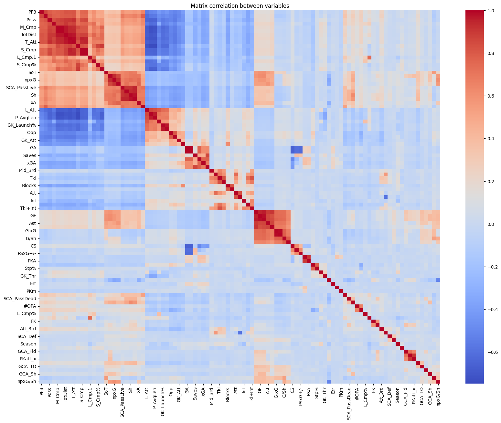
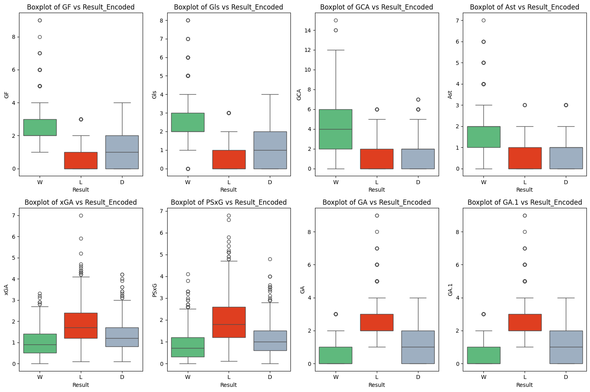

<!-- PROJECT LOGO -->

    
  <h3 align="center">Football League Predictions</h3>

<!-- ABOUT THE PROJECT -->

## About The Project
Football is one of the world’s most popular sports, attracting the interest of fans, coaches, media, and sports analysts. Predicting match outcomes is a complex challenge due to the many variables influencing results. This unpredictability, coupled with the analytical opportunities it presents, has fueled the development of predictive models to support sports analytics. In this study, we apply machine learning techniques to analyze various statistics from previous matches along with player attributes from both teams to forecast match outcomes. Multiple predictive models were tested, with experimental results showing promising accuracy and insights for sports analysis.

This presents an opportunity to create more advanced forecasting tools that predict the most probable outcome of a football match and provide confidence levels for each result, leading to more informed insights. Football match outcomes can be anticipated by analyzing historical data from past seasons. With the increasing availability of detailed data across various football leagues, it is possible to collect diverse features for analysis. In this study, we apply machine learning (ML) algorithms to predict football match outcomes, using multiple features that include match statistics and attributes of players from both teams.

## Related work
While the unpredictability of sports is well known, the football world occasionally witnesses results that defy expectations—such as Leicester City’s stunning English Premier League title win in the 2015/16 season. A detailed <a href="https://dl.acm.org/doi/10.1145/3097983.3098121">investigation</a> was conducted to explore the factors contributing to this remarkable success and to improve future prediction methods. Key findings highlighted Leicester's exceptional goalkeeper performance and their efficiency in counter-attacking. Additionally, several Leicester players consistently intercepted passes with a high probability of completion (over 80%). This case study also led to the development of a model to predict a team’s shots and goals during a game. The analysis revealed that models incorporating shot types (e.g., counter-attacks, shots from crosses into the penalty area) achieved more accurate predictions.

Another <a href="https://www.researchgate.net/publication/257569396_Football_Mining_with_R">study</a> analyzed data from the 2010/11 Italian Serie A season, using 300 games for training and 80 for testing. One key conclusion was that teams frequently relying on aerial plays were more likely to draw or lose matches. Further <a href="https://www.mdpi.com/2076-3417/10/1/46">research</a> explored machine learning to forecast football match outcomes based on match and player attributes. A simulation study, covering all matches from the top five European football leagues and their second divisions between 2006 and 2018, found that an ensemble approach significantly improved prediction accuracy and offered valuable insights for analyzing match outcomes.

## Problem Statement
The analysis revealed that studies with lower model performance often lacked variables that effectively capture key characteristics of players and the dynamics of the game. Additionally, it is crucial for models to be trained on data spanning multiple seasons, as teams tend to undergo significant changes each season, affecting performance and outcomes.

## Analysis and Processing of Data
### Data Description
The data for this project was collected by scraping historical football match statistics from the website <a href="https://fbref.com/en/comps/9/Premier-League-Stats">FBRef</a>. 
A dataset of 1660 football matches across five seasons, from 2020/2021 to 2024/2025, was collected. However, since only seven games had been played in the ongoing 2024/2025 season at the time of data collection, data from this season was excluded from the analysis. The remaining 1520 matches pertain to the top tier of English football, officially known as the Premier League. Out of these games, the home team won 666 times (20.94%), 340 matches ended in a draw (10.69%), and the away team won 514 times (16.16%).

### Data Exploration
Among the available variables, an analysis was conducted to determine which were most strongly related to each other, which variables had the highest predictive power for the "goal" attribute, and which could be excluded. To assess the relationships between variables, a correlation matrix was created for all numerical variables. 

The variables with the highest positive correlation are those that evaluate the overall quality of a football team. These include passing stats like 'M_Cmp'(Medium Passes Completed), 'T_Att'(Total Passes Attempted), 'TotDist'(Total Passing Distance) and 'xA' (Expected Assits). Similarly, for goal scoring 'Gls'(Goals scored), 'GF'(Match Goals For), 'Ast'(Assits), 'G/Sh'(Goals per shot) and 'xG'(Expected Goals). It can also be observed that the variables like 'L_Cmp'(GK Passes Completed), 'SCA_Fld'(Fouls drawn that lead to shot attempt), 'Att_3rd'(tackles in attacking third) and 'Attendance' have low correlation with Goals.

The correlation matrix also played a crucial role in identifying variables to be removed from the initial dataset. In classification tasks, variables with high correlation to others need to be excluded to avoid overestimating their importance, which could negatively impact result predictions. When two variables are identical, one becomes redundant and does not contribute valuable information to the model training. As an example, the variables "S_Cmp" and "S_Att", representing the Short passes completed and attempted, were removed due to their correlation exceeding 0.9.

A crucial step before entering the forecasting phase is identifying variables that can most effectively predict the match outcome, in our case result. To accomplish this, multiple visualizations were created to analyze the relationship between each variable and match outcomes: win, draw, and loss. These visualizations revealed four key variables GF, Gls, GCA, and Ast that are most predictive of a game’s result, as shown below. In addition to identifying these predictive variables, an analysis was conducted to find variables with minimal relevance for predicting the target outcome. This analysis indicated that xGA, PSxG, GA, and GA.1 contribute little value to the model and are therefore less useful for training the model.

### Goalkeeper Performance
An analysis was conducted to identify the best goalkeeper teams per season and the relationships among various performance metrics. To visualize these relationships, a bar graph was created for each season. This structured approach provided valuable insights into goalkeeper performance, enabling the identification of top goalkeepers for each team across multiple seasons. The findings enhance our understanding of the factors that contribute to a goalkeeper's success and highlight the teams that consistently excel in this area.

The performance of a goalkeeper can greatly influence match outcomes, particularly through their ability to stop goals. The key metrics used to evaluate goalkeeper performance include:

- **Saves**: The total number of shots the goalkeeper has blocked.
- **Clean Sheets (CS)**: Matches in which the goalkeeper has prevented the opposing team from scoring.
- **Penalty Saves (PKsv)**: The number of penalty kicks saved by the goalkeeper.
- **Crosses Stopped (Stp)**: The number of crosses that the goalkeeper successfully intercepted or cleared.

By analyzing these statistics, we can identify patterns in goalkeeper performance and its relationship with team success across different seasons.
This analysis provides a deeper understanding of how goalkeeper performance impacts team success. By examining key metrics such as Saves, Clean Sheets, Penalty Saves, and Crosses Stopped, we can identify the best goalkeeper teams and predict match outcomes. Visualizations such as heatmaps, line plots, and bar charts further clarify these relationships, while machine learning models offer predictive insights for future matches. This exploration underscores the importance of goalkeepers in football, not just in individual performance, but in contributing to overall team success across seasons.

